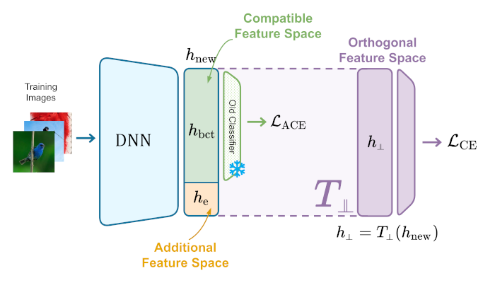

# OCA
Code for "Backward-Compatible Aligned Representations via an Orthogonal Transformation Layer" (https://arxiv.org/abs/2408.08793).

Code adapted from https://github.com/apple/ml-fct and https://github.com/YifeiZhou02/BT-2




## Requirements
To create the Conda virtual environment, please run:

```bash
conda env create -f environment.yml
conda activate OCA
```

## Dataset Preparation
Make dataset, checkpoint and logs directories.
```bash
mkdir data_store
mkdir checkpoints
mkdir logs_result
```
### Cifar100
Please refer to https://www.cs.toronto.edu/~kriz/cifar.html for downloading Cifar100.

### Imagenet 1k
Please refer to https://www.image-net.org/challenges/LSVRC/2012/index.php for downloading the Imagenet 1k.

## Example Experiments on Cifar100
We provide training and evaluation experiment configurations for Cifar100 in <code>./configs</code>. The following commands are training experiments from ResNet50 to ResNet50 (with data change of 50 classes to 100 classes).

### Train and Eval script
```bash
bash run_train_eval.sh
```   

The results are saved in <code>logs_result</code> folder.


## Cite our paper
```bibtex
@misc{ricci2024backwardcompatiblealignedrepresentationsorthogonal,
      title={Backward-Compatible Aligned Representations via an Orthogonal Transformation Layer}, 
      author={Simone Ricci and Niccolò Biondi and Federico Pernici and Alberto Del Bimbo},
      year={2024},
      eprint={2408.08793},
      archivePrefix={arXiv},
      primaryClass={cs.CV},
      url={https://arxiv.org/abs/2408.08793}, 
}
```
